# LDTS 2021/2022 - Tetris

## Group G1505 elements

| Name                 | Number    | E-Mail                 |
| -------------------- | --------- | ---------------------- |
| Dinis Sousa          | 202006303 |up202006303@edu.fe.up.pt|
| Francsica Silva      | 202005140 |up202005140@edu.fe.up.pt|
| Miguel Teixeira      | 202005208 |up202005208@edu.fe.up.pt|

## Table of contents
1. [How to Play](#how-to-play)
2. [Implemented Features](#implemented-features)
3. [GameShots](#game-shots)
4. [Design Patterns](#design-patterns)
    1. [Facade](#facade)
        1. [Problem](#problem)
        2. [Solution](#solution)
        3. [Implementation](#implementation)
    2. [Singleton](#singleton)
        1. [Problem](#problem-1)
        2. [Solution](#solution-1)
        3. [Implementation](#implementation-1)
    3. [State Pattern](#state-pattern)
        1. [Problem](#problem-2)
        2. [Solution](#solution-2)
        3. [Implementation](#implementation-2)
    4. [Factory Method Pattern](#factory-method-pattern)
        1. [Problem](#problem-3)
        2. [Solution](#solution-3)
        3. [Implementation](#implementation-3)
    5. [Game Loop Pattern](#game-loop-pattern)
        1. [Problem](#problem-4)
        2. [Solution](#solution-4)
        3. [Implementation](#implementation-4)
    6. [MVC Architecture](#mvc-architecture)
        1. [Problem](#problem-5)
        2. [Solution](#solution-5)
        3. [Implementation](#implementation-5)
5. [Code Smells and Possible Refactoring](#code-smells-and-possible-refactorings)
   1. [Composing Methods](#composing-methods)
       2. [Extracting Method](#extracting-method)
   2. [Removing Repeated Code](#removing-repeated-code)
       1. [Replace Using Extracting Method](#replace-using-extracting-method)
6. [Additional Features](#additional-features)
    1. [Shadow of Tetrimino](#shadow-of-tetrimino)
7. [Tests](#tests)
8. [Self-Evaluation](#self-evaluation)

## How to Play

Tetris is simple, your bring down tetriminos from the top of the screen. You can move them around
and rotate them. The tetriminos fall at a certain rate, wich increases as the game proceeds, but you can make
them fall faster if you are sure of your positioning. Your objective is to fill all the empty space in a line.
Every time you do this, you will find that the line vanished and you get awarded some points.
Tetris goal is simply to fight the computerized tetrimino dropper in order to last as long as you can while gaining
as much points as you can.

Controls
Game menu:
- `Up/X`  - Rotate clockwise
- `Z`     - Rotate counterclockwise
- `Left`  - Shift to the left
- `Right` - Shift to the right
- `Down`  - Shift down
- `Space` - Drop down
- `Q/ECS` - Exit to menu

Main menu:
- `Up`    - Select above option
- `Down`  - Select down option
- `Enter` - Select current option
- `Q/ECS` - Exit

Rules menu:
- `Q/ECS` - Exit to main menu

## Implemented Features
Currently when you run Tetris, you'll see the Starting Menu
- [x] Starting Menu
- [x] Rules Menu
- [x] Game Over Menu
- [x] Game Playground
- [x] Stats
- [x] Tetriminos
- [x] Board of fallen blocks
- [x] Queue of Tetriminos
- [x] Shadow of Tetrimino
- [x] Multiple Levels
- [x] Background Music

## Game Shots

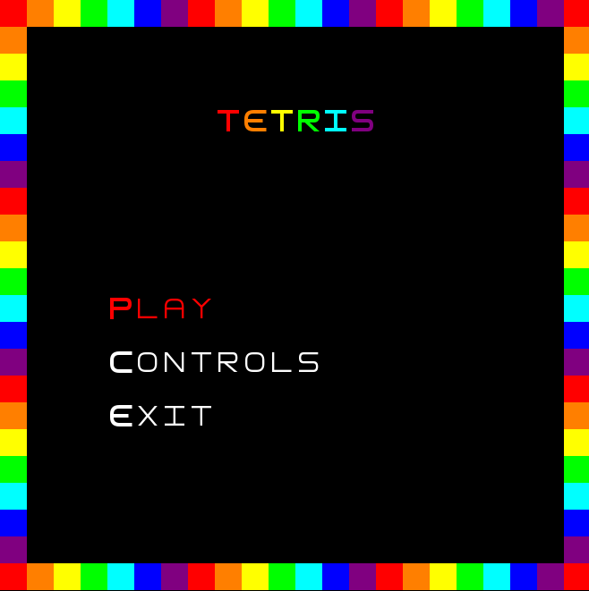

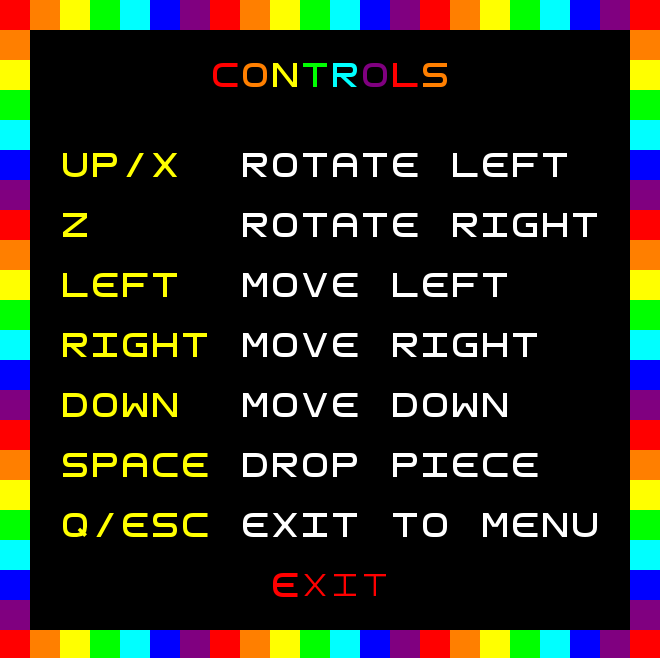

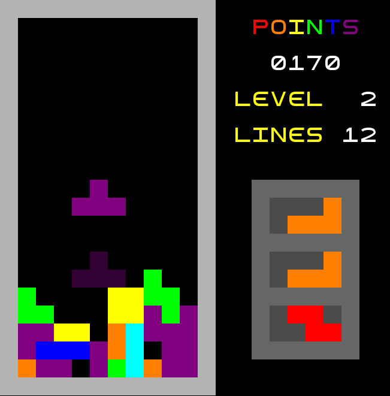

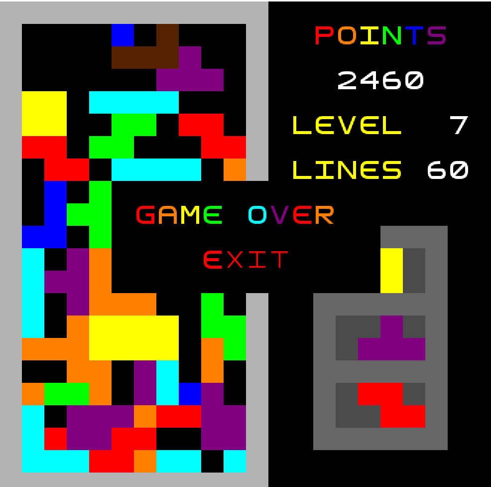

## Design Patterns

### Facade

#### Problem
We are using a framework called Lanterna to use as our GUI framework for the game. This framework has more method than we need to use and in order to render an object on screen sometimes long segments of code are needed. If we called the Lanterna methods directcly in our code it would be much harder to read or mantain

#### Solution
> The Facade Pattern: A facade is a class that provides a simple interface to a complex subsystem which contains lots of moving parts. A facade might provide limited functionality in comparison to working with the subsystem directly. However, it includes only those features that clients really care aboout, in our case, the methods that can render the diffrent components of our game!

#### Implementation
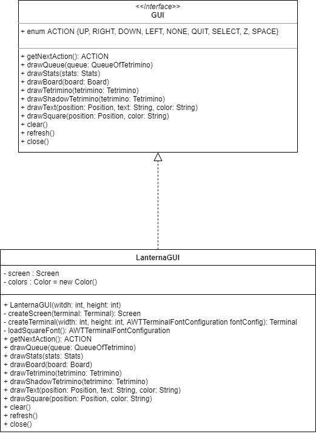

**The classes can be found in the following files:**
> [GUI](../src/main/java/Tetris/gui/GUI.java)
> 
> [Lanterna GUI](../src/main/java/Tetris/gui/LanternaGUI.java)

### Singleton

#### Problem
In our project, there classes of which it is not supposed to exist more than one instance of that class. For example, in a game like Tetris you do not want the main object to be created more than once, as you are supposed to play a "game" at a time in the same device. Moreover, the class Music in our project loads the music that can be listened in our game everytime it is constructed, by having it as a Singleton, it will only load the music file once.

#### Solution
> The Singleton Pattern: Creating a singleton is achieved in two steps, making the constructor private and create a getInstance() method that returns the instance of the class if it already exists or creates a new instance if it does not exist yet.

#### Implementation
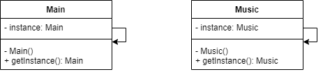

**The classes can be found in the following files:**
> [Main](../src/main/java/Tetris/Main.java)
>
> [Music](../src/main/java/Tetris/model/game/Music.java)

### State Pattern

#### Problem
A game works like a finite-state machine. At any given time, a game can only be in some given state. On the case of Tetris, you can be either in the Menu, seeing the Rules, playing the actual Game or sad because you are on the GameEnd. One could use conditional logic to change between the states. However, not only that would be harder to read and maintain, but it would also be violation of the Single Responsibility Principle and the Open Closed Principle.

#### Solution
>Create a classes for all the different states. All the different states implement the same State interface. This allows the Main to render different Views and have the user work on different Controllers by only knowing in which state it is.

### Implementation
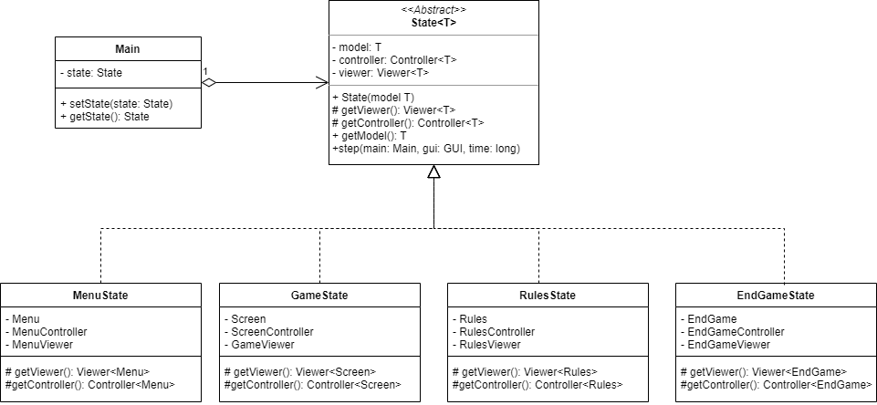

**The classes can be found in the following files:**
> [Main](../src/main/java/Tetris/Main.java)
>
> [State](../src/main/java/Tetris/states/State.java)
> 
> [MenuState](../src/main/java/Tetris/states/MenuState.java)
> 
> [GameState](../src/main/java/Tetris/states/GameState.java)
>
> [RulesState](../src/main/java/Tetris/states/RulesState.java)
> 
> [EndGameState](../src/main/java/Tetris/states/EndGameState.java)

### Factory Method Pattern

#### Problem
Imagine that you have a method that needs to return objects of different classes each time it is called. When applying the State Pattern we ran into that problem. For each different state, we needed the methods getController() and getViewer() to return objects of different classes. But how can we do this?

#### Solution
>Factory Method is a creational design pattern that provides an interface for creating objects in a superclass, but allows subclasses to alter the type of objects that will be created. That way, the same State interface can return different Controllers and Viewers and needed.

#### Implementation

**The classes can be found in the following files:**
> [State](../src/main/java/Tetris/states/State.java)
>
> [MenuState](../src/main/java/Tetris/states/MenuState.java)
>
> [GameState](../src/main/java/Tetris/states/GameState.java)
>
> [RulesState](../src/main/java/Tetris/states/RulesState.java)
>
> [EndGameState](../src/main/java/Tetris/states/EndGameState.java)

### Game Loop Pattern

### Problem
In a game like Tetris, the game should loop continuously during gameplay.

#### Solution
>For each turn of the loop, it processes user input without blocking, updates the game state, and renders the game. It tracks the passage of time to control the rate of gameplay. The game loop makes it possible for the game to run smoothly regardless of a user's input, or lack thereof. It also allows an easier frame rate management. 

#### Implementation
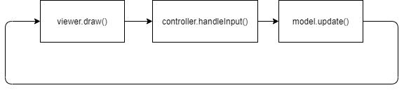

### MVC Architecture

### Problem
In the game of Tetris, or more broadly, in any given game or application that uses a Graphical User Interface to communicate with the user, how can the different components be separated?

#### Solution
A common solution to this is the use of the MVC Architecture (also known as Model-View-Controller), which consists in dividing the application in three parts (the model, the view and the controller).

**Model** - Contains purely the application information, and it is independent of the GUI. In the case of Tetris, the game model for example stores the Tetrimino's information, what blocks are on the board and where, how many points the user has, etc...

**Viewer** - This part is the one that helps the user to visualize the model data. The view calls the GUI to represent the model data in a way that the user can interact with.

**Controller** - Most of the work is done by the controller. It converts the user inputs in commands for the application, which result in changes to the model.

#### Implementation
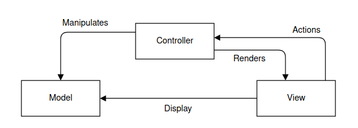

**The Model Classes can be found in the following files:**
> [Color](../src/main/java/Tetris/model/Color.java)
> 
> [Position](../src/main/java/Tetris/model/Position.java)
>
> >**Menu Model**
> >
> >[Menu](../src/main/java/Tetris/model/menu/Menu.java)
> 
> >**Game Model**
> >
> >[Block](../src/main/java/Tetris/model/game/Block.java)
> >
> >[Board](../src/main/java/Tetris/model/game/Board.java)
> >
> >[Music](../src/main/java/Tetris/model/game/Music.java)
> >
> >[QueueOfTetriminos](../src/main/java/Tetris/model/game/QueueOfTetrimino.java)
> >
> >[Screen](../src/main/java/Tetris/model/game/Screen.java)
> >
> >[Stats](../src/main/java/Tetris/model/game/Stats.java)
> >
> >[Tetrimino](../src/main/java/Tetris/model/game/Tetrimino.java)
> >
> >[TetriminoDirection](../src/main/java/Tetris/model/game/TetriminoDirection.java)
> >
> >[Tetriminos](../src/main/java/Tetris/model/game/Tetriminos)
> 
> >**Rules Model**
> >
> >[Rules](../src/main/java/Tetris/model/rules/Rules.java)
> 
> >**End Game Model**
> >
> >[EndGame](../src/main/java/Tetris/model/endGame/EndGame.java)
 
 **The Controller Classes can be found in the following files:**
 > [Controller](../src/main/java/Tetris/controller/Controller.java)
 > 
 > > **Menu Controller**
 > >
 > > [MenuController](../src/main/java/Tetris/controller/MenuController.java)
 > 
 > > **Game Controller**
 > >
> > [GameController](../src/main/java/Tetris/controller/game/GameController.java)
 > >
> >[ScreenController](../src/main/java/Tetris/controller/game/ScreenController.java)
 > 
> >  **Rules Controller**
 > >
 > > [RulesController](../src/main/java/Tetris/controller/RulesController.java)
 > 
> > **EndGame Controller**
 > >
 > > [EndGameController](../src/main/java/Tetris/controller/MenuController.java)

**The Viewer Classes can be found in the following files:**
> [Viewer](../src/main/java/Tetris/viewer/Viewer.java)
>
> > **Menu Viewer**
> >
> > [MenuViewer](../src/main/java/Tetris/viewer/MenuViewer.java)
>
> > **Game Viewer**
> >
> > [GameViewer](../src/main/java/Tetris/viewer/GameViewer.java)
>
> >  **Rules Viewer**
> >
> > [RulesViewer](../src/main/java/Tetris/viewer/RulesViewer.java)
>
> > **EndGame Viewer**
> >
> > [EndGameViewer](../src/main/java/Tetris/viewer/MenuViewer.java)

## Code Smells and Possible Refactorings
If there's one thing we learned while developing the code for this delivery it's that there's always room for improvement. Over the past few weeks we changed our code numerous times. With that in mind we will now list code smells that we intend to analyse in the future as well as possible refactorings.

### Composing Methods

#### Extracting Method
In this example we verified that the function "moveDow" is a **Long Method** and does 5 separate things.
1) Verifies if the tetrimino reached the bottom
2) Fills the board with the blocks from the tetrimino
3) Removes all full lines from the board
4) Changes the tetrimino to the next on the queue
5) Checks if it is game over

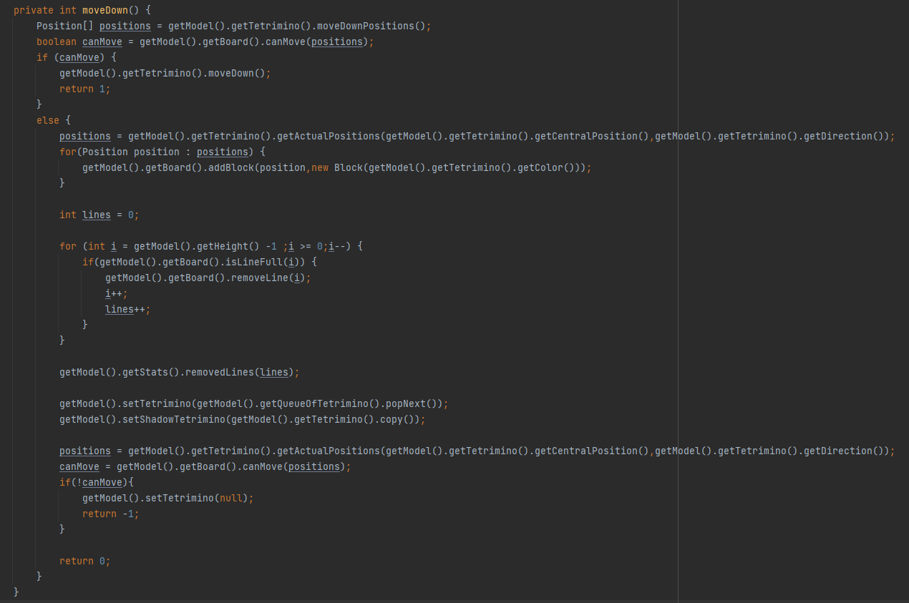

To remove this smell we can split the function into four new function calls.

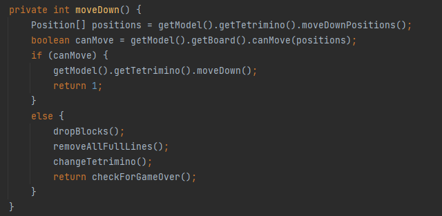

### Removing Repeated Code
#### Replace Using Extracting Method

In this case we had two pieces of code which were repeated in two different classes.

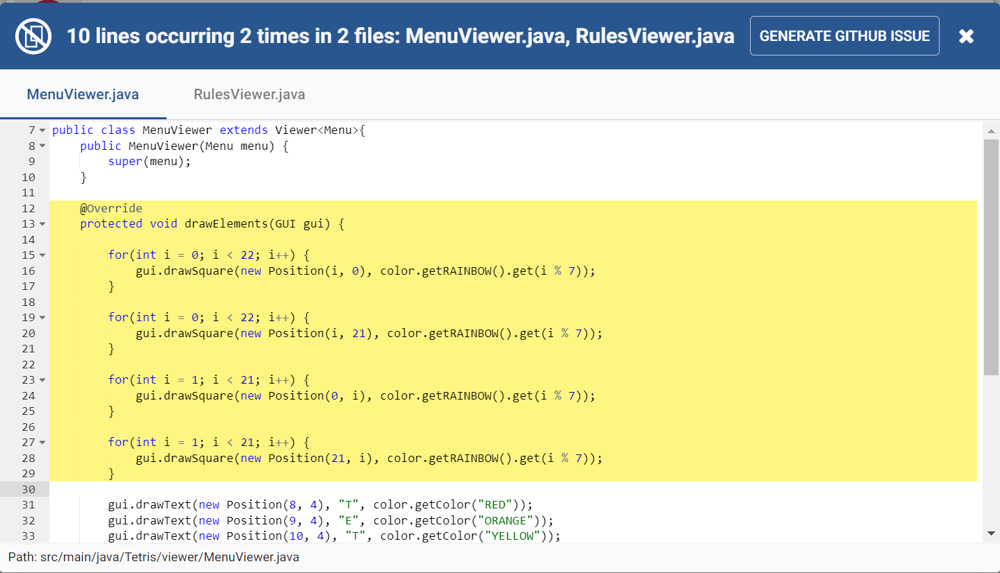
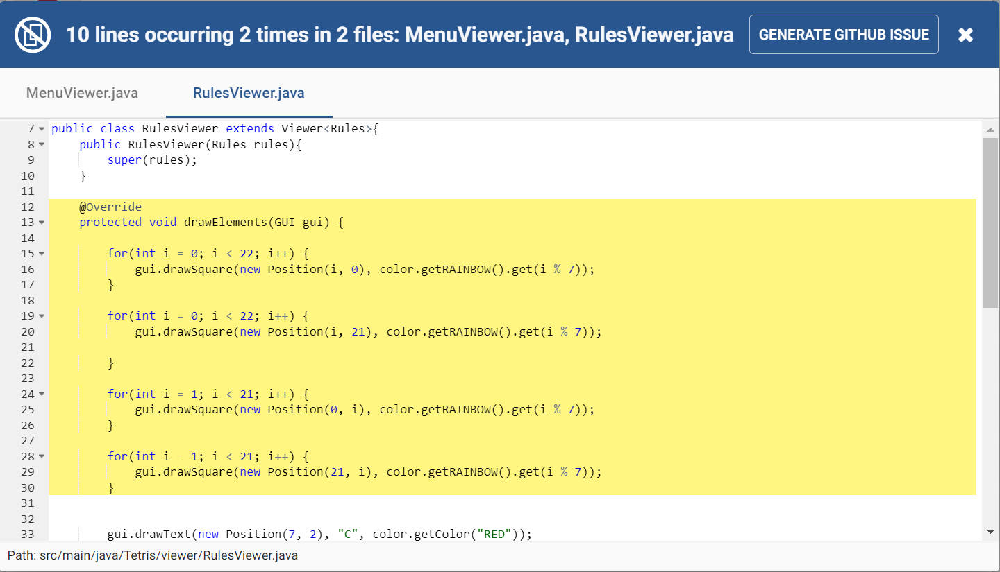
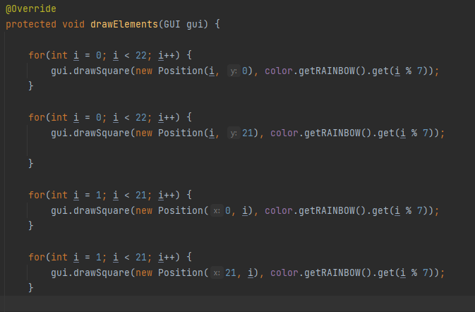

To remove this smell, like before, we put them into a new function call.
Also, we had unnecessary "for loops" that could be merged into only two.

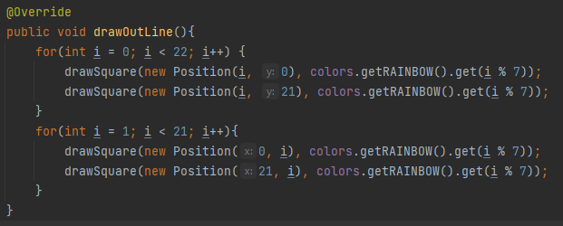

This was the resulting function.

## Additional Features 

### Shadow of Tetrimino

One of the features we think is worth mentioning, is the tetrimino shadow. When playing the game you can 
see a shadow representation of your tetrimino at the bottom of the screen, this figure gives you a representation
of where your piece will be when dropped, which is really helpful. 
Implementing this figure lead us to some interesting challenges.

First we wanted to use the same base code for the shadow since we thought implementing other class to be the shadow was not
the way to do it. So the shadow is a tetrimino like every other, but has a different name to the Screen class, which allows us 
to use the same functions and features from the tetrimino class.
For example, when moving the shadow we use the same functions as the other tetriminos but, when we need to move the shadow to its next
position we call the dropShadow function, which uses the moveDown function from the tetrimino in a "while" loop, just as the dropDown function, but differently, in order to accomplish the needs
of our shadow movement.

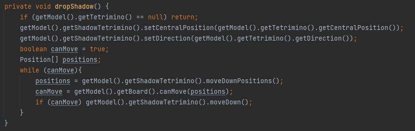

Another example is when drawing the shadow we call its draw function, just like we do with the other tetriminos. However, this functions gets its colors from a different map, which has the same color names as keys, but darker colors.

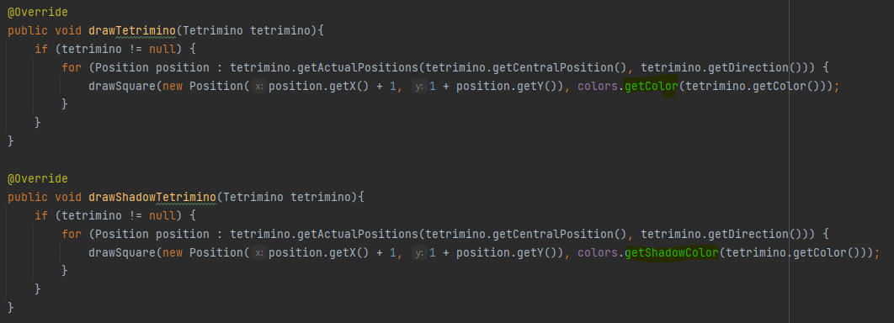

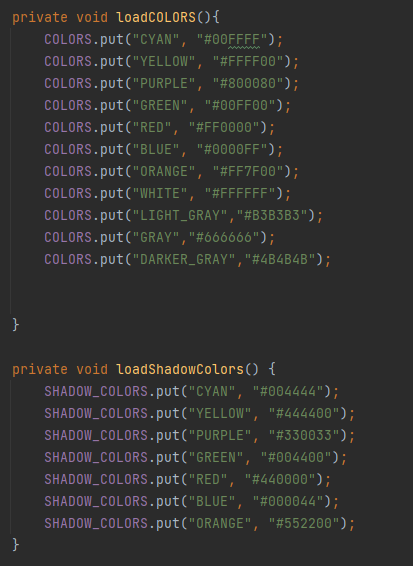

## Tests

### PIT TEST
The pitest is working and generating a report on the test's strenght and coverage. However, PIT seems not to work when testing terminal functions, which are functions that need an instance of main to work. Unfortunately 16/29 of our tests worked in that manner, and so the PIT report has only 13 tests in it. Nevertheless, here is it:

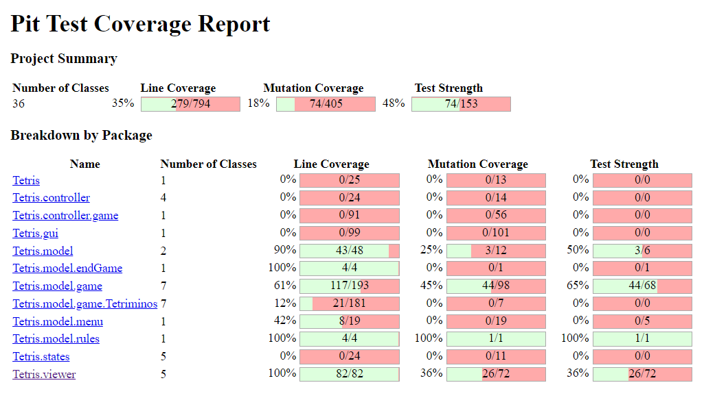

### TEST
The tests were all made before to the code (following a TDD), except for the viewer tests, which we found difficult to create test prior to the implementation of the code itself.

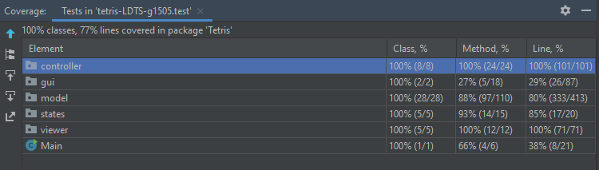

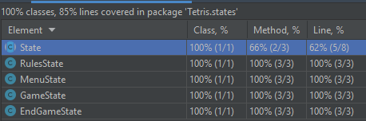

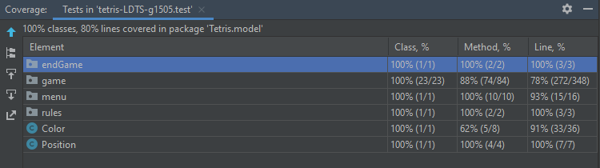

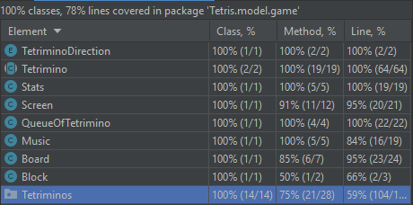

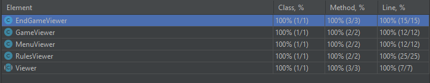

## Self-Evaluation

| Name                 |     Contribution     |
| -------------------- | -------------------- | 
| Dinis Sousa          |         1/3          |
| Francisca Silva      |         1/3          |
| Miguel Teixeira      |         1/3          |

