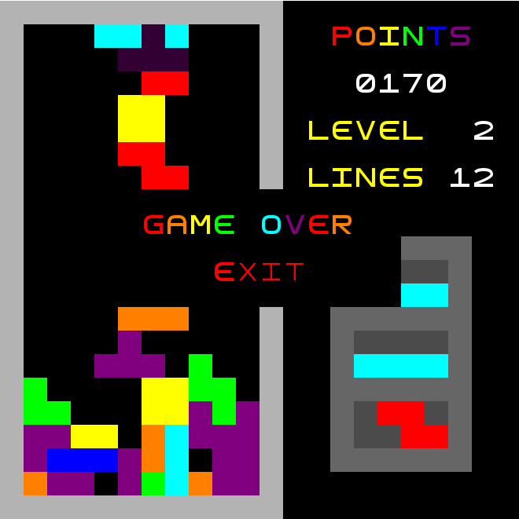

# LDTS 2021/2022 - Tetris

## Group G1505 elements

| Name                 | Number    | E-Mail                 |
| -------------------- | --------- | ---------------------- |
| Dinis Sousa          | 202006303 |up202006303@edu.fe.up.pt|
| Francsica Silva      | 202005140 |up202005140@edu.fe.up.pt|
| Miguel Teixeira      | 202005208 |up202005208@edu.fe.up.pt|

## Table of contents
1. [How to Play](#how-to-play)
2. [Implemented Features](#implemented-features)
3. [GameShots](#game-shots)
4. [Design Patterns](#design-patterns)
    1. [Lanterna Facade](#lanterna-facade)
        1. [Problem in Context](#problem-in-context)
        2. [Implementation](#implementation)
        2. [The Pattern](#the-pattern)
        3. [Consequences](#consequences)
    2. [Game Loop](#game-loop)
        1. [Problem in Context](#problem-in-context-1)
        2. [Implementation](#implementation-1)
        2. [The Pattern](#the-pattern-1)
        3. [Consequences](#consequences-1)
    3. [Movement Command Pattern](#movementcommand-pattern)
        1. [Problem in Context](#problem-in-context-2)
        2. [Implementation](#implementation-2)
        2. [The Pattern](#the-pattern-2)
        3. [Consequences](#consequences-2)
    4. [Button Command Patter](#buttoncommand-pattern)
        1. [Problem in Context](#problem-in-context-3)
        2. [Implementation](#implementation-3)
        2. [The Pattern](#the-pattern-3)
        3. [Consequences](#consequences-3)
    5. [Changing Game States - State Pattern](#changing-game-states)
        1. [Problem in Context](#problem-in-context-5)
        2. [Implementation](#implementation-5)
        2. [The Pattern](#the-pattern-5)
        3. [Consequences](#consequences-5)
5. [Architectural Pattern](#architectural-pattern)
6. [Code Smells and Possible Refactoring](#code-smells-and-possible-refactorings)
    1. [Composing Methods](#composing-methods)
        2. [Extracting Method](#extracting-method)
    2. [Removing Repeated Code](#removing-repeated-code)
        1. [Replace Using Extracting Method](#replace-using-extracting-method)
7. [Additional Features](#additional-features)
    1. [Shadow of Tetrimino](#shadow-of-tetrimino)
8. [Tests](#tests)
9. [Self-Evaluation](#self-evaluation)

## How to Play

Tetris is simple, your bring down tetriminos from the top of the screen. You can move them around
and rotate them. The tetriminos fall at a certain rate, wich increases as the game proceeds, but you can make
them fall faster if you are sure of your positioning. Your objective is to fill all the empty space in a line. 
Every time you do this, you will find that the line vanished and you get awarded some points.
Tetris goal is simply to fight the computerized tetrimino dropper in order to last as long as you can while gaining
as much points as you can.

Controls
Game menu:
- `Up/X`  - Rotate clockwise
- `Z`     - Rotate counterclockwise
- `Left`  - Shift to the left
- `Right` - Shift to the right
- `Down`  - Shift down
- `Space` - Drop down
- `Q/ECS` - Exit to menu

Main menu:
- `Up`    - Select above option
- `Down`  - Select down option
- `Enter` - Select current option
- `Q/ECS` - Exit

Rules menu:
- `Q/ECS` - Exit to main menu

## Implemented Features
Currently when you run Tetris, you'll see the Starting Menu
- [x] Starting Menu
- [x] Rules Menu
- [x] Game Over Menu
- [x] Game Playground
- [x] Stats
- [x] Tetriminos
- [x] Board of fallen blocks
- [x] Queue of Tetriminos
- [x] Shadow of Tetrimino
- [x] Multiple Levels
- [x] Background Music

## Game Shots

## Code Smells and Possible Refactorings
If there's one thing we learned while developing the code for this delivery it's that there's always room for improvement. Over the past few weeks we changed our code numerous times. With that in mind we will now list code smells that we intend to analyse in the future as well as possible refactorings.

### Composing Methods

#### Extracting Method
In this example we verified that the function "moveDow" is a **Long Method** and does 5 separate things.
1) Verifies if the tetrimino reached the bottom
2) Fills the board with the blocks from the tetrimino
3) Removes all full lines from the board
4) Changes the tetrimino to the next on the queue
5) Checks if it is game over

To remove this smell we can split the function into four new function calls.

### Removing Repeated Code
#### Replace Using Extracting Method

In this case we had two pieces of code which were repeated in two different classes.

To remove this smell, like before, we put them into a new function call.
Also, we had unnecessary "for loops" that could be merged into only two.

This was the resulting function.

## Additional Features 

### Shadow of Tetrimino

One of the features we think is worth mentioning, is the tetrimino shadow. When playing the game you can 
see a shadow representation of your tetrimino at the bottom of the screen, this figure gives you a representation
of where your piece will be when dropped, which is really helpful. 
Implementing this figure lead us to some interesting challenges.

First we wanted to use the same base code for the shadow since we thought implementing other class to be the shadow was not
the way to do it. So the shadow is a tetrimino like every other, but has a different name to the Screen class, which allows us 
to use the same functions and features from the tetrimino class.
For example, when moving the shadow we use the same functions as the other tetriminos but, when we need to move the shadow to its next
position we call the dropShadow function, which uses the moveDown function from the tetrimino in a "while" loop, just as the dropDown function, but differently, in order to accomplish the needs
of our shadow movement.

Another example is when drawing the shadow we call its draw function, just like we do with the other tetriminos. However, this functions gets its colors from a different map, which has the same color names as keys, but darker colors.

## Tests

### PIT TEST

### TEST

## Self-Evaluation

| Name                 |     Contribution     |
| -------------------- | -------------------- | 
| Dinis Sousa          |         1/3          |
| Francisca Silva      |         1/3          |
| Miguel Teixeira      |         1/3          |